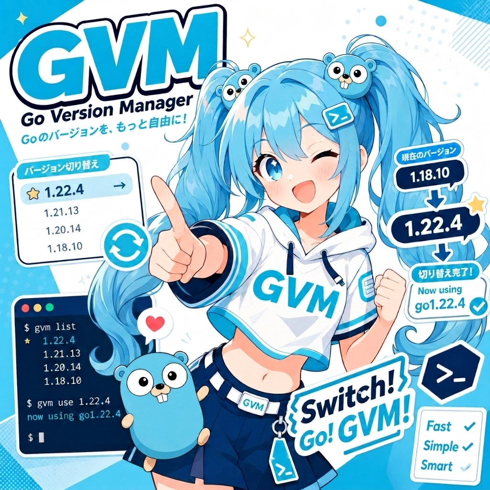

# VS Code Go Version Manager (GVM) Extension

> **2026-05-03** — Fixed `gvm list` output parsing: the original regex only matched lines starting with `goX.Y`, which missed some GVM output formats. Now correctly extracts version strings like `goX.Y.Z` from any position in the line. The icon generated by [ChatGPT Images 2.0](https://chatgpt.com) and [Nona Banana 2](https://gemini.google/overview/image-generation).

 

## Overview

This Visual Studio Code extension allows users to seamlessly switch between different Go versions managed by GVM (Go Version Manager). It updates the `go.goroot` and `go.gopath` settings in VS Code based on the selected Go version from the gvm list.

## Features

* Easy integration with GVM.
* Quick selection of Go versions directly from VS Code.
* Automatic update of `go.goroot` and `go.gopath` workspace settings.

## Usage

1. Open the Command Palette (Ctrl+Shift+P or Cmd+Shift+P on macOS).
2. Type and select Select Go Version from the list of commands.
3. A dropdown will appear with the list of installed Go versions (as per gvm list).
4. Select the desired Go version. The extension will automatically update the go.goroot and go.gopath settings for the workspace.

## Contributing

Contributions to the extension are welcome! Please feel free to fork the repository, make changes, and create a pull request.

## Author
khan-yin [@khan-yin] (https://github.com/khan-yin)

## Acknowledgments

Thanks to the original [vscode-go-version-switcher](https://github.com/anativ/vscode-go-version-switcher) by Alon Nativ ([@anativ](https://github.com/anativ)).

## License

MIT LICENSE